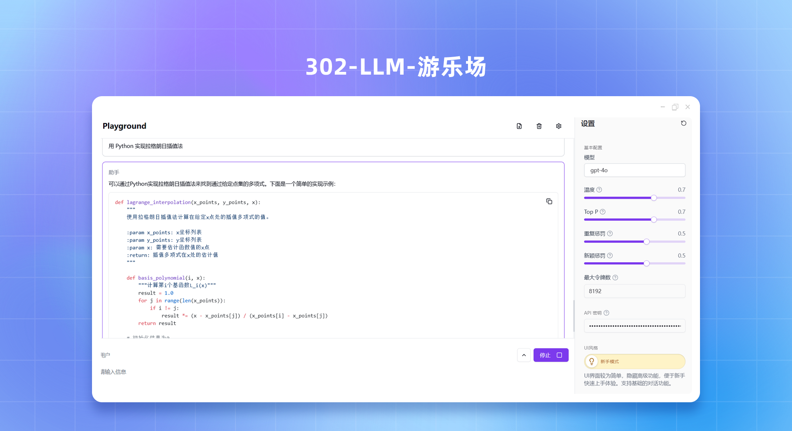
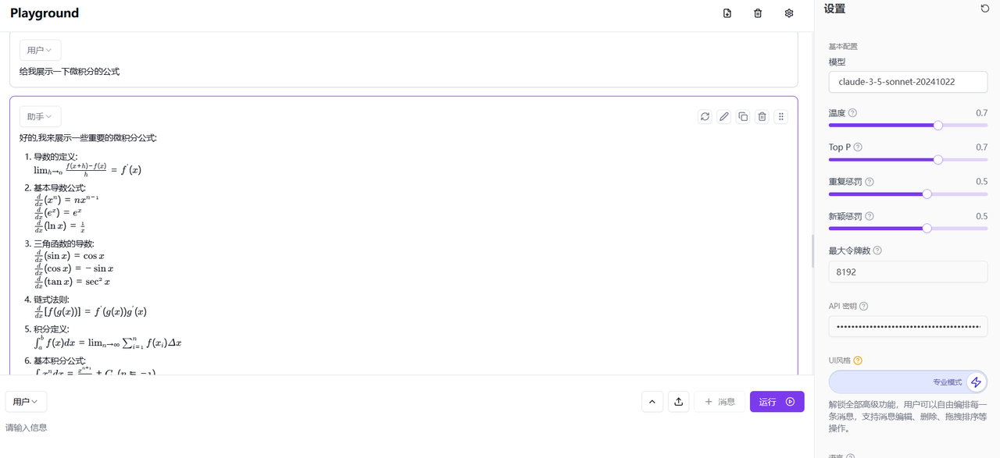
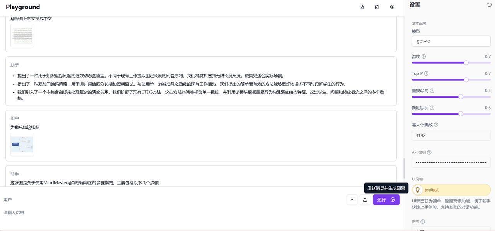
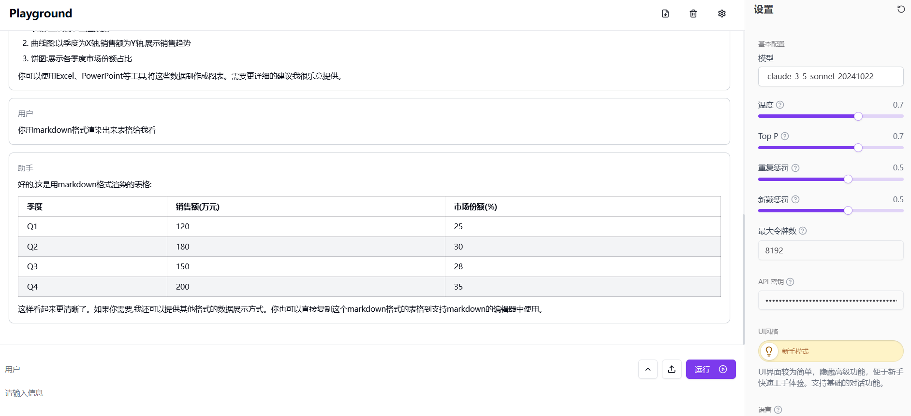
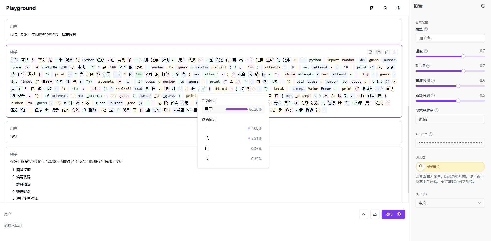

# <p align="center">🤖 LLM Playground🚀✨</p>

<p align="center">Eine leistungsstarke und interaktive experimentelle Plattform zum Experimentieren mit großen Sprachmodellen, basierend auf Next.js 14 und modernen Web-Technologien.</p>

<p align="center">Dieses Projekt ist ein abgeleitetes Werk basierend auf <a href="https://github.com/302ai/302_llm_playground" target="_blank">302ai/302_llm_playground</a></p>

<p align="center"><a href="https://302.ai/de/apis/" target="blank"></a></p >

<p align="center"><a href="../README.md">中文</a> | <a href="README_en.md">English</a> | <a href="README_ja.md">日本語</a> | <a href="README_ru.md">Русский</a> | <a href="README_fr.md">Français</a> | <a href="README_de.md">Deutsch</a></p>

 

## Schnittstellenvorschau
   Generierung von Ergebnissen basierend auf Benutzereingabe mit Unterstützung für LaTeX-Ausdrucks-Rendering.
        

   Möglichkeit zum Hochladen von Bildern als Kontext für Gespräche.
        

   Unterstützung für Diagramm-Rendering.
   

   In OpenAI-Modellen gibt es eine Funktion zur Anzeige der Token-Wahrscheinlichkeit, mit der die Wahrscheinlichkeit des aktuell ausgewählten Tokens sowie mehrere alternative Tokens und deren Wahrscheinlichkeiten abgerufen werden können.
   
   
## ✨ Hauptfunktionen ✨

1. **Interaktive Chat-Oberfläche**
   - Markdown-Bearbeitung und -Vorschau in Echtzeit
   - Rollenbasierte Gespräche
   - Benutzer können Bilder für Gespräche hochladen
   - In OpenAI-Modellen kann die Token-Wahrscheinlichkeit angezeigt werden
   - Erweiterte Nachrichtenoperationen: Neuordnung, Kopieren, Regenerierung
   - Expertenmodus: Verbesserte Bearbeitung und Rollensteuerung
   - Feedback und Animationen für nahtlose Benutzererfahrung
   - Modellkonfiguration und AI-Parameteranpassung
   - Responsives und barrierefreies Design


2. **Rich-Text-Editor**
   - Erweitertes Markdown im GitHub-Stil
   - Unterstützung für LaTeX-Ausdrücke über KaTeX
   - Unterstützung für Mermaid-Diagramm-Rendering
   - Persistenz von Inhalten und Echtzeit-Rendering


3. **Moderne Benutzererfahrung**
   - Anpassbare und responsive Benutzeroberfläche
   - Animationen, Benachrichtigungen und Fehlerbehandlung
   - Mobile und barrierefreie Komponenten

4. **Erweiterte Funktionen**
   - IndexedDB-Persistenz, mehrsprachige Unterstützung
   - API-Integration und Nachrichtenverlaufsverwaltung
   - Erweiterte Protokollierung und optimierte API-Verarbeitung
   - Internationalisierung und dynamische Übersetzung

## Technologie-Stack 🛠️

- **Framework**: Next.js 14
- **Sprache**: TypeScript
- **Stil**: Tailwind CSS, Radix UI
- **Zustandsverwaltung**: Jotai
- **Datenspeicherung**: IndexedDB mit Dexie.js
- **Internationalisierung**: next-intl

## Projektstruktur 📁

```plaintext
src/
├── actions/
├── app/
├── components/
│   ├── playground/
│   └── ui/
├── constants/
├── db/
├── hooks/
├── i18n/
├── stores/
├── styles/
└── utils/
```

## Schnellstart 🚀

### Voraussetzungen

- Node.js (LTS-Version)
- pnpm oder npm
- 302.AI API-Schlüssel

### Installation

1. Klonen Sie das Repository:
   ```bash
   git clone https://github.com/xiaomizhoubaobei/LLM-Playground
   cd LLM-Playground
   ```
   
2. Installieren Sie die Abhängigkeiten:
   ```bash
   pnpm install
   ```

3. Konfigurieren Sie die Umgebungsvariablen:
   ```bash
   cp .env.example .env.local
   ```

   - `AI_302_API_KEY`: Ihr 302.AI API-Schlüssel
   - `AI_302_API_URL`: API-Endpunkt

### Entwicklung

Starten Sie den Entwicklungsserver:

```bash
pnpm dev
```

Besuchen Sie [http://localhost:3000](http://localhost:3000), um die Anwendung anzuzeigen.

### Produktionsbuild

```bash
pnpm build
pnpm start
```

## Docker-Bereitstellung 🐳

### Verwendung vorgefertigter Images

- **DockerHub**: `qixiaoxin/iflow-cartoonize-api`
- **GitHub Container Registry**: `ghcr.io/xiaomizhoubaobei/llm_playground`
- **Alibaba Cloud**: `crpi-wk2d8umombj539de.cn-shanghai.personal.cr.aliyuncs.com/xmz-1/302_llm_playground`

```bash
# Verwendung des DockerHub-Images
docker pull qixiaoxin/iflow-cartoonize-api:latest
docker run -p 3000:3000 qixiaoxin/iflow-cartoonize-api:latest

# Verwendung des GHCR-Images
docker pull ghcr.io/xiaomizhoubaobei/llm_playground:latest
docker run -p 3000:3000 ghcr.io/xiaomizhoubaobei/llm_playground:latest

# Verwendung des Alibaba Cloud-Images
docker pull crpi-wk2d8umombj539de.cn-shanghai.personal.cr.aliyuncs.com/xmz-1/302_llm_playground:latest
docker run -p 3000:3000 crpi-wk2d8umombj539de.cn-shanghai.personal.cr.aliyuncs.com/xmz-1/302_llm_playground:latest
```

### Build aus dem Quellcode

```bash
docker build -t llm_playground .
docker run -p 3000:3000 llm_playground
```

### Laufzeit-Umgebungsvariablen

⚠️ **Wichtig**: Das Docker-Image benötigt einen echten 302.AI API-Schlüssel für den Betrieb.

```bash
docker run -d \
  -e AI_302_API_KEY=your-actual-api-key \
  -e AI_302_API_URL=https://api.302.ai \
  -e NEXT_PUBLIC_AI_302_API_UPLOAD_URL=https://dash-api.302.ai/gpt/api/upload/gpt/image \
  -p 3000:3000 \
  llm_playground:latest
```

**Beschreibung der Umgebungsvariablen:**

| Variablenname | Beschreibung | Erforderlich |
|----------------|-------------|--------------|
| `AI_302_API_KEY` | 302.AI API-Schlüssel | ✅ Ja |
| `AI_302_API_URL` | API-Dienstadresse | ✅ Ja |
| `NEXT_PUBLIC_AI_302_API_UPLOAD_URL` | Datei-Upload-Adresse | ✅ Ja |

API-Schlüssel erhalten: https://302.ai/apis/

## Beitrag 🤝

Beiträge sind willkommen! Zögern Sie nicht, Probleme und Pull-Requests zu senden.

## Lizenz 📜

Dieses Projekt ist unter der GNU Affero General Public License v3.0 lizenziert. Weitere Informationen finden Sie in der [LICENSE](LICENSE)-Datei.

---

Erstellt mit Next.js und 302.AI ❤️