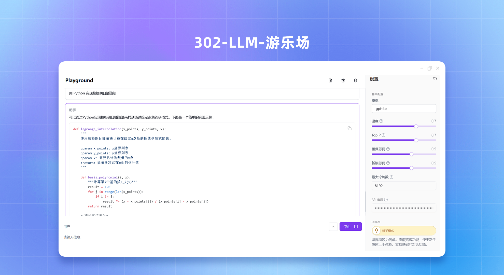
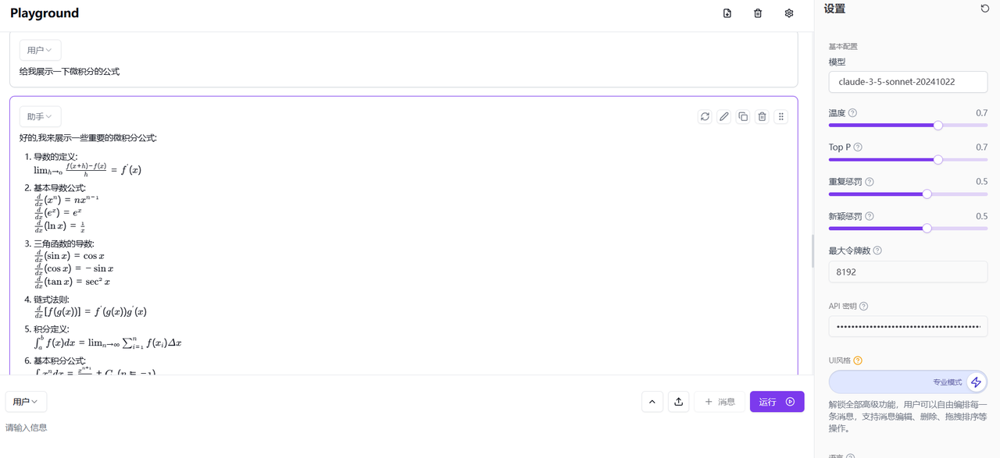
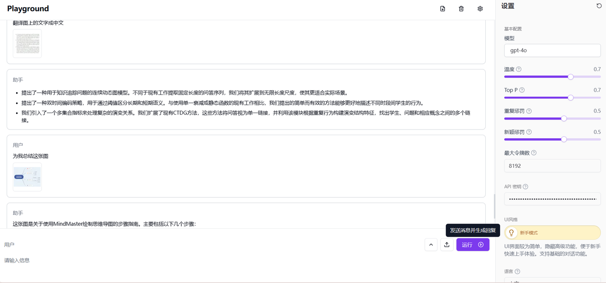
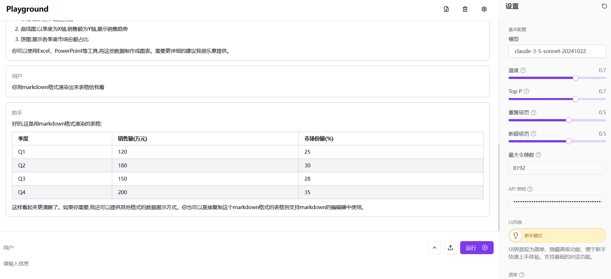
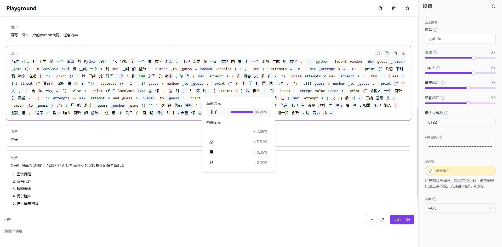

# <p align="center">🤖 LLM Playground🚀✨</p>

<p align="center">Мощная и интерактивная экспериментальная платформа для работы с большими языковыми моделями, созданная на основе Next.js 14 и современных веб-технологий.</p>

<p align="center">Этот проект является производным от <a href="https://github.com/302ai/302_llm_playground" target="_blank">302ai/302_llm_playground</a></p>

<p align="center"><a href="https://302.ai/ru/apis/" target="blank"></a></p >

<p align="center"><a href="../README.md">中文</a> | <a href="README_en.md">English</a> | <a href="README_ja.md">日本語</a> | <a href="README_ru.md">Русский</a> | <a href="README_fr.md">Français</a> | <a href="README_de.md">Deutsch</a></p>



## Предварительный просмотр интерфейса
   Генерация результатов на основе пользовательского ввода с поддержкой рендеринга выражений LaTeX.
   

   Возможность загрузки изображений в качестве контекста для диалога.
   

   Поддержка рендеринга диаграмм.
   

   В моделях OpenAI есть функция отображения вероятности токенов, позволяющая получить вероятность текущего выбранного токена, а также несколько альтернативных токенов и их вероятности.
   

## ✨ Основные функции ✨

1. **Интерактивный интерфейс чата**
   - Редактирование и предварительный просмотр Markdown в реальном времени
   - Диалог на основе ролей
   - Пользователи могут загружать изображения для диалога
   - В моделях OpenAI можно отображать вероятность токенов
   - Расширенные операции с сообщениями: переупорядочивание, копирование, регенерация
   - Режим эксперта: улучшенное редактирование и управление ролями
   - Обратная связь и анимации для бесшовного пользовательского опыта
   - Настройка модели и настройка параметров ИИ
   - Адаптивный и доступный дизайн


2. **Редактор форматированного текста**
   - Расширенный Markdown в стиле GitHub
   - Поддержка выражений LaTeX через KaTeX
   - Поддержка рендеринга диаграмм Mermaid
   - Сохранение содержимого и рендеринг в реальном времени


3. **Современный пользовательский опыт**
   - Настраиваемый и адаптивный пользовательский интерфейс
   - Анимации, уведомления и обработка ошибок
   - Мобильные и доступные компоненты

4. **Расширенные функции**
   - Сохранение в IndexedDB, поддержка нескольких языков
   - Интеграция API и управление историей сообщений
   - Расширенное ведение журнала и оптимизированная обработка API
   - Интернационализация и динамический перевод

## Технологический стек 🛠️

- **Фреймворк**: Next.js 14
- **Язык**: TypeScript
- **Стиль**: Tailwind CSS, Radix UI
- **Управление состоянием**: Jotai
- **Хранение данных**: IndexedDB с Dexie.js
- **Интернационализация**: next-intl

## Структура проекта 📁

```plaintext
src/
├── actions/
├── app/
├── components/
│   ├── playground/
│   └── ui/
├── constants/
├── db/
├── hooks/
├── i18n/
├── stores/
├── styles/
└── utils/
```

## Быстрый старт 🚀

### Предварительные требования

- Node.js (версия LTS)
- pnpm или npm
- Ключ API 302.AI

### Установка

1. Клонируйте репозиторий:
   ```bash
   git clone https://github.com/xiaomizhoubaobei/LLM-Playground
   cd LLM-Playground
   ```

2. Установите зависимости:
   ```bash
   pnpm install
   ```

3. Настройте переменные окружения:
   ```bash
   cp .env.example .env.local
   ```

   - `AI_302_API_KEY`: Ваш ключ API 302.AI
   - `AI_302_API_URL`: Конечная точка API

### Разработка

Запустите сервер разработки:

```bash
pnpm dev
```

Посетите [http://localhost:3000](http://localhost:3000), чтобы просмотреть приложение.

### Сборка для продакшена

```bash
pnpm build
pnpm start
```

## Развертывание Docker 🐳

### Использование готовых образов

- **DockerHub**: `qixiaoxin/iflow-cartoonize-api`
- **GitHub Container Registry**: `ghcr.io/xiaomizhoubaobei/llm_playground`
- **Alibaba Cloud**: `crpi-wk2d8umombj539de.cn-shanghai.personal.cr.aliyuncs.com/xmz-1/302_llm_playground`

```bash
# Использование образа DockerHub
docker pull qixiaoxin/iflow-cartoonize-api:latest
docker run -p 3000:3000 qixiaoxin/iflow-cartoonize-api:latest

# Использование образа GHCR
docker pull ghcr.io/xiaomizhoubaobei/llm_playground:latest
docker run -p 3000:3000 ghcr.io/xiaomizhoubaobei/llm_playground:latest

# Использование образа Alibaba Cloud
docker pull crpi-wk2d8umombj539de.cn-shanghai.personal.cr.aliyuncs.com/xmz-1/302_llm_playground:latest
docker run -p 3000:3000 crpi-wk2d8umombj539de.cn-shanghai.personal.cr.aliyuncs.com/xmz-1/302_llm_playground:latest
```

### Сборка из исходного кода

```bash
docker build -t llm_playground .
docker run -p 3000:3000 llm_playground
```

### Переменные окружения во время выполнения

⚠️ **Важно**: Для работы образа Docker необходимо передать реальный ключ API 302.AI.

```bash
docker run -d \
  -e AI_302_API_KEY=your-actual-api-key \
  -e AI_302_API_URL=https://api.302.ai \
  -e NEXT_PUBLIC_AI_302_API_UPLOAD_URL=https://dash-api.302.ai/gpt/api/upload/gpt/image \
  -p 3000:3000 \
  llm_playground:latest
```

**Описание переменных окружения:**

| Имя переменной | Описание | Обязательно |
|----------------|----------|-------------|
| `AI_302_API_KEY` | Ключ API 302.AI | ✅ Да |
| `AI_302_API_URL` | Адрес службы API | ✅ Да |
| `NEXT_PUBLIC_AI_302_API_UPLOAD_URL` | Адрес загрузки файлов | ✅ Да |

Получить ключ API: https://302.ai/apis/

## Вклад 🤝

Добро пожаловать для внесения вклада! Не стесняйтесь отправлять вопросы и запросы на вытягивание.

## Лицензия 📜

Этот проект лицензирован в соответствии с GNU Affero General Public License v3.0. Подробнее см. в файле [LICENSE](LICENSE).

---

Создано с использованием Next.js и 302.AI ❤️
